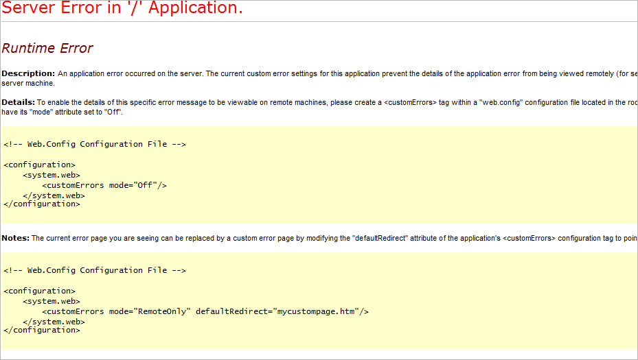
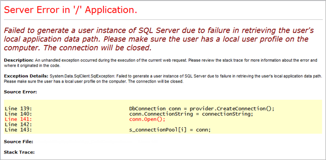

# web-application-in-debug-mode

## Issue description

This check determines whether the web application is in ASP.NET Debug Mode. This may be a valid configuration for use in the development and test environments; however, it is not recommended for use in production environments.

## Explanation

Configuring a web application to be in debug mode provides additional information about errors. Usually, web applications in test and development environments are configured to be in debug mode so that the testers and developers can get extended information about ASP.NET errors.

This is an example of an ASP.NET error message coming from a web application that is not in the debug mode.



_Server Error in ‘/’ Application._  
_Runtime Error_

**Description**: An application error occurred on the server. The current custom error settings for this application prevent the details of this application error from being viewed remotely \(for security reasons\). It could, however, be viewed by browsers running on the local server machine.

**Details**: To enable the details of this specific error message to be viewable on remote machines, please create a  tag within a “web.config” configuration file located in the root directory of the current web application. This  tag should then have its “mode” attribute set to “Off”.

```markup
<!-- Web.Config Configuration File -->
<configuration> 
    <system.web> 
        <customErrors mode="Off"/> 
    </system.web> 
</configuration>
```

**Notes:** The current error page you are seeing can be replaced by a custom error page by modifying the “defaultRedirect” attribute of the application’s  configuration tag to point to a custom error page URL.

```markup
<!-- Web.Config Configuration File -->
<configuration>
    <system.web>
        <customErrors mode="RemoteOnly" defaultRedirect="mycustompage.htm"/>
    </system.web>
</configuration>
```

Following figure is an example of the ASP.NET Runtime error coming from a web application with debug mode enabled.



Debug mode can reveal some detailed information about the system, eventually helping an attacker to find a weak point or to exploit and compromise the system. That’s the main reason for disabling it in a production environment.

Debug mode is disabled by default.

## Solution

Verify that the debug mode is disabled in the production environment. To do so, open the **Internet Information Services Manager**, open the server branch in the tree view on the left side, and then open Sites branch. Find the affected web application, right-click its name in the tree view, and click **Explore**. Open **web.config** file with Notepad and make sure that the following is configured:

* Turn off the call stack

  ```markup
  CallStack=”false”
  ```

* Enable custom errors in Visual Studio 

  ```markup
  <customErrors mode=”On”/>
  ```

* Disable compilation debugging 

  ```markup
  <compilation debug=”false”>
  ```

## Additional information

Additional information can be found in the following articles:

* [Enable Debugging and set custom errors off in SharePoint](https://blogs.msdn.microsoft.com/voyage/2014/09/02/enable-debugging-and-set-custom-errors-off-in-sharepoint/)
* [Debugging SharePoint Solutions](https://msdn.microsoft.com/en-us/library/ee231550.aspx)

